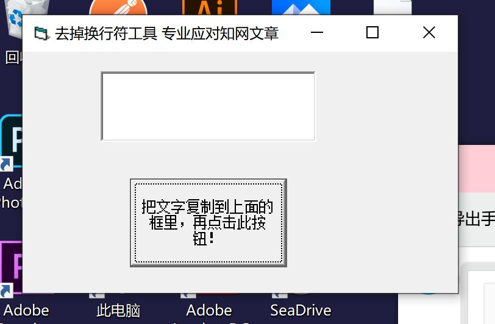

无题
==========
我是个，不太喜欢回忆的人。  
比起做些事记录下些什么（甚至于让别人记住些什么），我更喜欢经历。  
比如，外出旅游，我妈妈总喜欢到处拍拍拍，不仅拍风景，还要拍人，拍我，拍我们俩一起。
她还有一本相集，是那个数码相机不怎么普及的年代。厚厚的一本，她和她的室友、朋友，还有各种各样的人一起。  
有一天她突然问我，能把这些相片电子化保存吗。我玩着手机心不在焉的回答“可以，去扫描一下就可以了，或者干脆用你现在的手机拍下来，你现在的手机拍照的清晰度也是顶尖水平了。”    
去到一个地方，她总问我不拍点照吗，我说不拍，不太喜欢拍照。“不喜欢拍人的话拍点景也好啊”“那更没必要了，现在想看哪个景区百度地图就完事了，还有好多景区直接有官方的电子游览。”  
她摇摇头，用过来人的口气对我说“还是年轻啊，等将来，这些都会成为你一辈子的回忆的。”“不过其实也是，我年轻的时候也没那么喜欢回忆。也是直到这两年，才后悔小时候为什么没有多记录些你的照片出来”。
不过那时候也没有数码相机啊，拍个照片都得用胶卷还得洗出来，我心想。  
甚至于，我们还曾经为和以前同学的关系维持发生过分歧。固然我有其他方面的原因，她也许知道也许不知道罢，不过实事求是的讲，不考虑所谓其他方面的原因，可能我的确是一个比较向前看的人吧。
除了在上学时候就有很密切关系的个别亲密朋友之外，也的确懒得维持和大多数人的关系。（不过说回来，我在大学难道不是吗，只和几个很好的朋友交流很多，而有一部分同学甚至至今还没加过微信）  
  
可说来奇怪，我这样一个人，却喜欢收集周边。想不到吧。
魔法少女小圆，我有一个日本买的巨大手办，还有之前趁便宜在淘宝上收的全套扭蛋；还有V家的周边，买过文件夹挂钩钥匙扣立牌等等一系列东西；
以及奇迹暖暖和恋与制作人，还有最近不到一年沉迷的战斗吧歌姬。说起来我买这些周边的心态还有点奇怪：自己喜欢收集是一方面，
还有我不知道怎么有了一种“为自己热爱并且欣赏的事物打钱是一种责任”的奇怪思想，如果我真的喜欢或者粉一个东西就应该积极主动打钱维持他们的运营，
虽然知道自己打的那点钱什么都不算，但心里还会有如果每个粉丝/玩家都这样那IP的未来一定会越来越好之类的想法。  
  
不过，周边一般是不代表回忆的，（除非极端情况比如游戏关服了之类的）。对于回忆，我有时显得有点，特别满不在乎。记得中考之后没几天，我彻底清理了我的卧室，
扔掉了包括pia ji（我不知道这玩意普通话咋说，总之是一种圆形硬纸片，通过用自己的纸片用力击打其他人放在地面上的纸片、以期让对方的纸片翻面或者移动的一种游戏）、
磁力魔棒（一种由棒状磁铁和铁球构成、可以拼接出各种几何结构乃至建筑物的玩具）、已经忘了叫什么名字的卡牌还有等等等等一大堆奇奇怪怪的回忆。
不仅如此，还试图扔掉小学时候的一些比如图书馆借书证、不是很重要的荣誉证书之类的物品，虽然后者都被我妈发现并阻止、东西被她收到她的卧室去保存了。  
我当时有一种说法，把自己的收拾东西叫做“抛弃历史”。“我抛弃了好多历史”，这现在看起来十分中二的话，当初是我的官方说法。  
当初觉得，“抛弃历史”是长大的标志，不需要的东西就应该坚决的丢掉，回忆都是所谓脑子里用来骗自己的，就算若干年后突然看见心里也只会回想起是过去的日子然后怀古伤今。
“回忆又不能当饭吃”，或者说，整个人类所谓自以为傲的情感和精神世界，统统不能当饭吃。  
  
我说不清现在的自己是怎么想的。大概总体来说还是上面的想法吧。仍旧是一如既往地不愿意拍照，比如闺蜜来沈阳找我玩我们游览了三四天硬是一张带人的照都没拍，
唯一拍的几张可能是本溪水洞里面瑰丽的自然奇观吧。  
写上面这一大段废话的起因是，我换电脑了。对过去的电脑显然没什么回忆，该过去的就直接过去就完事了，不过数据是一定要转移的，不为回忆也为一些将来能用到的东西，
不只是学习资料还有一些项目的起手式、范式以后可以用来复制粘贴，一些仍然在用的在玩的记录存档不想从头开始，一些配置好的环境和选项偏好不想清空。  
不过突然间，我就翻到了一个这样的东西。  

双击运行。在我的老笔记本上甚至打开全是乱码（因为切换了系统编码为UTF-8的缘故），只得在新电脑上才得以打开。这个程序是用VB写的，作用非常简单：
读取一个字符串，删除其中的\r和\n，然后把得到的结果保存到剪贴板。因为知网上下载下来的pdf如果在Adobe Reader里直接复制，
复制出来的东西会保证和原始文章的显示保持一样、每行都有一个换行符，尽管在语义上根本没有断行，十分的不方便。  
为了解决这个问题，我就用了大概一个下午的时间写出了这个程序，编译成了exe，甚至还通过微信把它发到了不知道班级群还是年级群上。
当时的自己觉得用编程解决现实中遇到的问题已经很厉害了，虽然现在看来是幼稚到家的程序+老掉牙的语言。  
说来有趣，我在来软院之前选修了一门计算机系的Java程序设计。为什么是Java呢？因为“听说Android程序需要用Java语言来开发”，
而当时的自己特别向往能写出一个在手机上跑得起来的程序。  
  
心里有一种说不出是什么的感觉。于是拿起手机，发了一条pyq。然后，放下手机，准备删除，像曾经删除各种程序，以及扔掉各种实物一样。在按下删除键前的0.5s，我犹豫了。  
我的电脑上，可能的确没必要容不下这么一个20KB的文件。  
虽然自己绝不是个喜欢保留回忆的人，但今天，此时此刻，又绝没打算把这么一个程序删掉。想想那是2017年。
11月，迷茫的生活刚刚开始，面对着所有的未知、渴望和恐惧，做了一个现在看来的确是草率但完全不感到后悔的决定，以及，开始认识一些现在对我也十分重要的人。
那时的自己绝没考虑过什么什么转系之类的事情，面对着一些被计程设折磨的人，我能写出简单的application就已经是很让我“自满”得了。当时觉得VB是很不错的语言，也希望着了解一下如何编写在手机上运行程序玩。  
  
如今的我，坐在东配楼实验室自己的位置上，开始碰一些无聊的炼丹，拥有自己的个人主页和服务器，最喜欢Kotlin、TypeScript、Python三大语言并掌握着我懒得罗列了的反正两只手勉强数的过来的语言，
还有了解了当时从未想象过的计算机的世界不仅有语言，还有数据库、有网络和协议、有操作系统、有编译器、有开源世界。  
一瞬间，有点佩服自己，不到三年的时间，已经掌握了如此多的知识和技术，过去的雕虫小技像是被降维打击了一样。
总觉得自己每天佛系生活、没学到什么东西，但现在一看，其实还是有学到的。和别人比这种事我是绝不会去做的，不过和自己比，真的很让自己惊讶和欣慰了吧。 

看看时间，也不得不去食堂吃饭了。所以创建这样一个项目，是因为我决定留下这个2017年的程序，但又不知道该把这样一个东西放在哪一个文件夹里。对了，那就Github吧。
突然想起了，Github不是还会把一大堆玩意丢进北冰洋来着，虽然这次活动已经结束了不过也保不齐会有下次的。  
  
这个项目，就是用来存储那些我不知道该放在自己的电脑的哪里的回忆，因为专门建一个“历史”文件夹这种事我是绝对绝对不会去做的。
现在，2020年，它暂时只有2017年的在2020年来看一个幼稚至极的VB程序。再看看自己手里的代码，机器学习项目，npm上的包，服务器上部署的应用，前后端各种各样的项目。
3年之后，5年之后，10年之后，20年之后，更远的的之后。自己再看到这些，是不是会觉得同样的幼稚呢？  

不过换个角度想啊，幼稚，不也是自己的吗？幼稚，不也是每个人都经历过的吗。

2020年8月30日 于清华大学东配楼